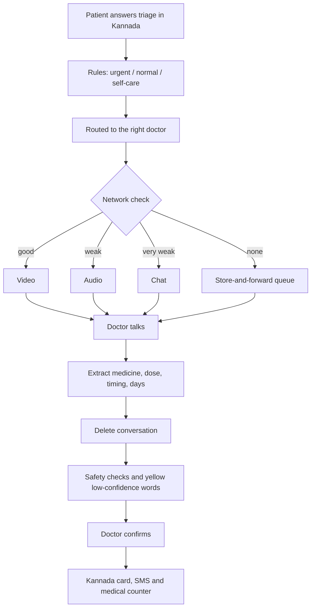

# Flow

```mermaid
flowchart TD
  A[Patient answers triage in Kannada] --> B[Rules: urgent / normal / self-care]
  B --> C[Routed to the right doctor]
  C --> D{Network check}
  D -->|good| E[Video]
  D -->|weak| F[Audio]
  D -->|very weak| G[Chat]
  D -->|none| H[Store-and-forward queue]
  E --> I[Doctor talks]
  F --> I
  G --> I
  H --> I
  I --> J[Extract medicine, dose, timing, days]
  J --> K[Delete conversation]
  K --> L[Safety checks and yellow low-confidence words]
  L --> M[Doctor confirms]
  M --> N[Kannada card, SMS and medical counter]
```
